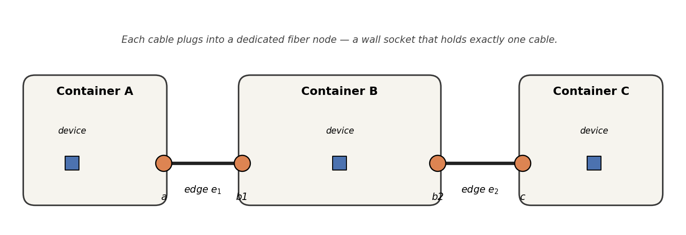
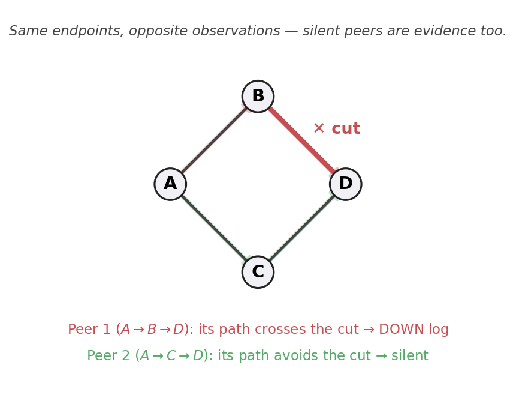
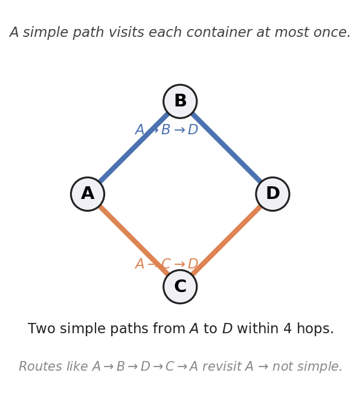
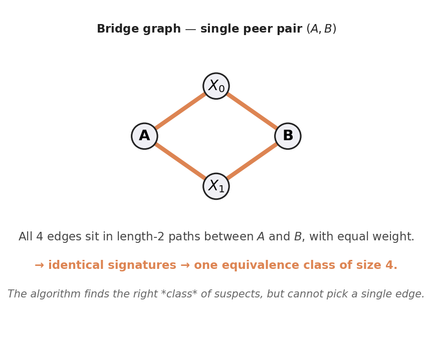
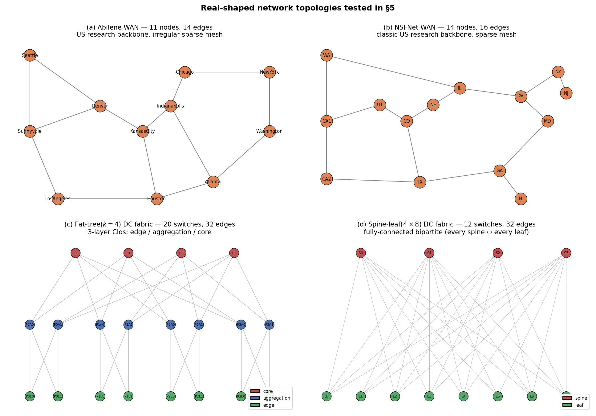
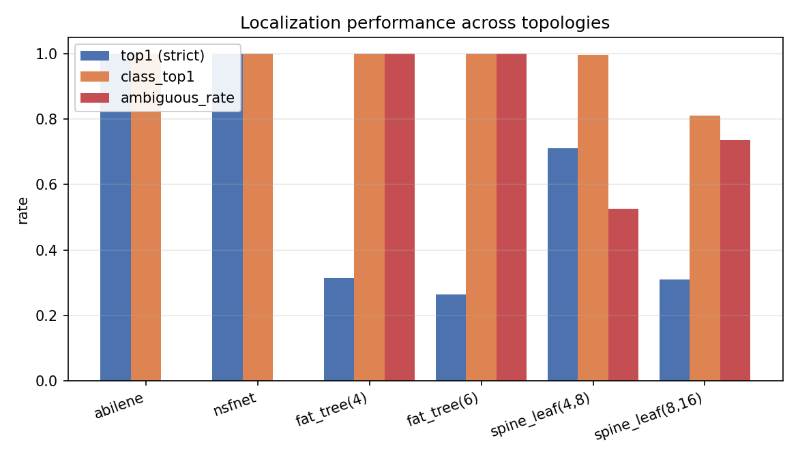
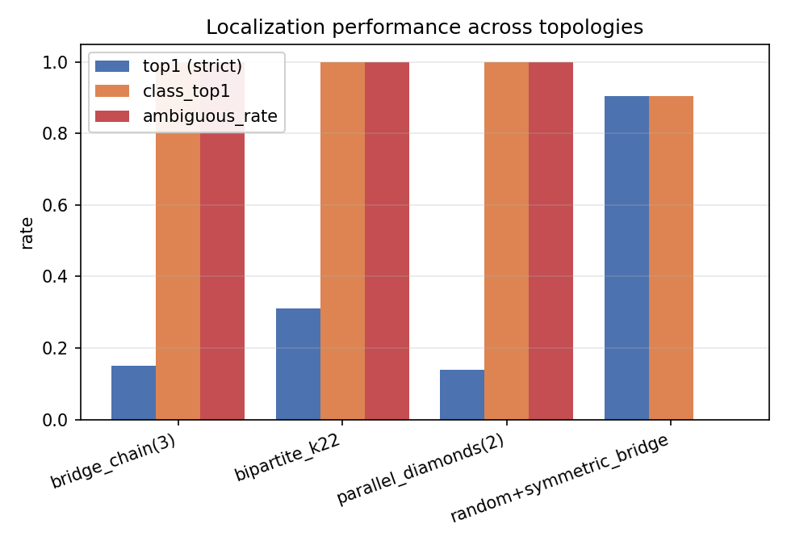
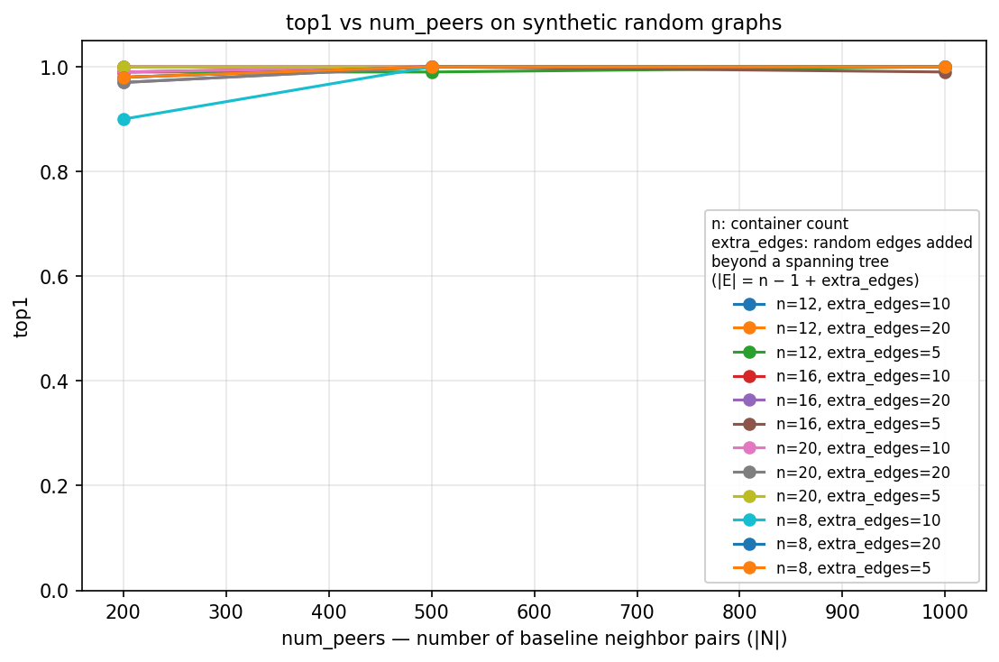

# Fiber-Cut Localization is Almost Always Uniquely Solvable

### An Identifiability View under High-Quality Logs

> **TL;DR.** Under realistic high-quality logging, single-edge fiber-cut localization is information-theoretic, not inference-limited: a failed edge is uniquely identifiable except when two edges share an *observational signature*. We derive a Bayesian log-likelihood scoring rule directly from a uniform-actual-path generative model. It hits the failed edge in `top-1` **100%** on WAN topologies (Abilene, NSFNet), and on highly symmetric DC fabrics (fat-tree, spine-leaf) where strict `top-1` is structurally capped by the equivalence-class size, **`class_top-1 = 0.99–1.00`** — the algorithm always pinpoints the correct suspect class.

---

## Abstract

We study the localization of a *single* fiber-cut failure in a network modeled as a container-level graph $G(V, E)$. Standard practice frames this as a noisy inference problem. We argue that under high-quality observability — true down logs are reliable, missing logs are rare — the residual difficulty is *identifiability*: a failure is uniquely localizable except when two edges contribute identically to every neighbor's candidate-path coverage. We make three contributions: (1) a Bayesian log-likelihood scoring rule derived directly from a uniform-actual-path generative model, requiring no ad-hoc path weighting; (2) an *identifiability checker* that maps each edge to its observational signature and groups edges into equivalence classes; (3) a reproducible empirical study separating algorithm gaps from identifiability gaps. On WAN backbones (Abilene, NSFNet) ambiguity is zero and `top-1 = 1.00`; on data-center fabrics (fat-tree, spine-leaf) ambiguity reaches 1.0 and strict `top-1` is capped by class size, but `class_top-1 = 0.99–1.00` — the algorithm always pinpoints the correct equivalence class.

## Contents

1. [Introduction](#1-introduction)
2. [Model](#2-model)
3. [Scoring](#3-scoring)
4. [Identifiability](#4-identifiability)
5. [Evaluation](#5-evaluation)
6. [Limitations](#6-limitations)
7. [Reproducing the results](#7-reproducing-the-results)
8. [Code map](#8-code-map)

---

## 1. Introduction

When a fiber edge in a packet network fails, an operator wants to know *which* one. Most existing approaches treat this as a robust inference problem: noisy logs, missing logs, false positives, conflicting reports. The framing assumes the difficulty is statistical.

We start from a different premise. In the systems we care about, logging is **high quality**: when a logical neighbor link is truly down, the operator almost always observes a log; when a down log is observed, the link is almost certainly down. Missing logs are rare enough to treat absence of a log as meaningful negative evidence.

Under these assumptions we ask: *how often does the data even contain enough information to point at a single edge?* Our finding is that the answer is "almost always" on real-world WAN topologies, and "essentially never on the strict edge level" on highly symmetric data-center fabrics — but in the latter case the answer is recoverable up to an equivalence class.

**Contributions.**
- A candidate-path scoring rule for single-edge fiber-cut localization that handles both positive and silent evidence (§3).
- A definition of *observational equivalence* over edges, an algorithm to compute equivalence classes by per-edge signatures, and an *identifiability checker* (§4).
- A class-aware evaluation metric (`class_top-k`) that decouples algorithmic skill from information-theoretic limits (§4).
- An empirical separation between WAN and DC topologies showing that the residual error on WANs is small, while on DC fabrics the *algorithm* is near-optimal up to identifiability (§5).

---

## 2. Model

### 2.1 Graph

Let $G(V, E)$ be undirected, where:
- $V$ is a set of containers — each may host several devices and **fiber endpoints (fiber nodes)**.
- $E$ is the set of physical fiber edges; each edge connects exactly two fiber endpoints, one per container.

We make two structural assumptions about the fiber layer:

1. **Dedicated fiber endpoints.** Every fiber node is an endpoint of exactly one edge. A container may host multiple fiber nodes, but no two edges share a fiber node. A single-edge cut therefore disables one specific pair of fiber endpoints and nothing else — it cannot cascade through a shared port — which is what makes "single-edge failure" a well-defined event at the container level.
2. **Devices are not pinned.** Devices are not bound to a specific fiber endpoint within their container; logical connectivity between two devices is inferred through paths in the container graph rather than by following a fixed device → fiber-node mapping.

An intuitive picture: think of containers as **buildings** and fiber nodes as **wall sockets**. Each cable plugs into one specific socket on each end — no socket is shared between two cables. A building can have multiple sockets, one per outgoing cable.



Container B holds **two** fiber nodes ($b_1$ and $b_2$), one for each of its two outgoing edges. If edge $e_1$ is cut, only the $a \leftrightarrow b_1$ pair goes dark; the $b_2$ socket is on a different physical fiber and keeps working. Devices inside the containers do not need to know which fiber node carries their traffic.

At the algorithmic level we work directly on the container graph $G(V, E)$ with $V = \\{A, B, C\\}$ and $E = \\{e_1, e_2\\}$. The internal fiber-node detail above is the picture in our heads — the dedicated-endpoint assumption is what lets us discard it.

### 2.2 Observability assumptions

Let $N \subseteq V \times V$ be the **baseline neighbor set**: a known set of peer pairs

$$x = (a_x, b_x), \qquad a_x, b_x \in V, \quad a_x \neq b_x,$$

that normally have logical connectivity. After a single edge $e^\star \in E$ fails, observation partitions $N$:

- $D \subseteq N$: peers that emit a DOWN log.
- $S = N \setminus D$: silent peers.

Assumptions:

1. **No false positives.** $\Pr[\text{DOWN log} \mid \text{link up}] \approx 0$.
2. **High recall.** $\Pr[\text{DOWN log} \mid \text{link down}] \approx 1$.
3. **Single-edge failure.** Exactly one $e^\star \in E$ at a time.

Under (1)–(2), both $D$ and $S$ are near-deterministic functions of $e^\star$, so silent peers carry *negative evidence* — a peer that *would have* failed if $e^\star$ lay on its path, but did not.

A small example to make the asymmetry concrete. Imagine the *diamond* container graph below, with edge $(B, D)$ just cut:



Both peers run between the same two endpoints $A$ and $D$, but they happen to have routed over different physical paths. Peer 1's path crosses the cut → it reports a DOWN log (counted in $D$). Peer 2's path avoids the cut → it stays quiet (counted in $S$).

The algorithm only sees the labels DOWN / silent. It does **not** see the actual physical paths. That asymmetry — same endpoints, opposite observations — is what makes silent peers informative: peer 2 is a witness that whatever path it actually used was *not* responsible for the failure, which lets us rule out edges along its candidate paths.

### 2.3 Routing is unknown

The actual physical path each peer uses is unobservable. For each $x = (a_x, b_x) \in N$ we enumerate the **candidate-path set**

$$P(x) \\;:=\\; \\{\\, p = (v_0, v_1, \dots, v_k) \\;:\\; v_0 = a_x,\\; v_k = b_x,\\; v_i \in V \text{ pairwise distinct},\\; (v_i, v_{i+1}) \in E,\\; k \le L \\,\\}, \qquad |P(x)| \le M.$$

A path $p$ is **simple** iff its containers $v_0, \dots, v_k$ are pairwise distinct. Defaults: $L = 4$, $M = 20$.



In the diamond above, $P(A, D) = \\{\\, A \to B \to D,\\; A \to C \to D \\,\\}$. A walk like $A \to B \to D \to C \to A$ revisits $A$, so it is not simple and never enters $P(\cdot)$.

---

## 3. Scoring

### 3.1 Generative model

For each peer $x \in N$ let $\pi(x)$ denote its **actual** physical path — a random variable taking values in $P(x)$. We make two assumptions:

- **A1 (uniform routing).** $\pi(x) \sim \mathrm{Uniform}(P(x))$, independent of $e^\star$.
- **A2 (high-quality logging, §2.2).** Peer $x$ reports DOWN iff $e^\star \in \pi(x)$.

Define the **candidate-coverage fraction**

$$f(x, e) \\;:=\\; \frac{|\\{\\, p \in P(x) \\;:\\; e \in p \\,\\}|}{|P(x)|} \\;\in\\; [0, 1].$$

> **Lemma (Likelihood).** *Under A1 and A2,*
>
> $$\Pr[d \in D \mid e^\star = e] = f(d, e), \qquad \Pr[s \in S \mid e^\star = e] = 1 - f(s, e).$$

*Proof.* By A2, the event $\\{d \in D\\}$ equals $\\{e^\star \in \pi(d)\\}$. Substituting and using independence (A1):

$$\Pr[d \in D \mid e^\star = e] \\;=\\; \Pr[e \in \pi(d) \mid e^\star = e] \\;\stackrel{\text{(A1)}}{=}\\; \Pr[e \in \pi(d)].$$

The second equality drops the conditional because the event $\\{e \in \pi(d)\\}$ depends only on $\pi(d)$, and A1 says $\pi(d) \perp e^\star$ — knowing which edge failed gives no information about which path $d$ chose. (The two occurrences of $e$ above refer to the same fixed edge: on the left it labels the conditioning value of $e^\star$, on the right it is the edge whose presence in $\pi(d)$ we are testing.)

Expanding by total probability over $\pi(d) \in P(d)$:

$$\Pr[e \in \pi(d)] \\;=\\; \sum_{p \in P(d)} \Pr[\pi(d) = p] \cdot \mathbb{1}[e \in p].$$

Apply A1's uniform law, $\Pr[\pi(d) = p] = 1/|P(d)|$ for every $p \in P(d)$, and pull the constant out of the sum:

$$=\\; \sum_{p \in P(d)} \frac{1}{|P(d)|} \cdot \mathbb{1}[e \in p] \\;=\\; \frac{1}{|P(d)|} \sum_{p \in P(d)} \mathbb{1}[e \in p].$$

Use the standard identity $\sum_{p \in S} \mathbb{1}[Q(p)] = |\\{p \in S : Q(p)\\}|$ (an indicator sum just counts how many elements satisfy the predicate) with $S = P(d)$ and $Q(p) = (e \in p)$:

$$=\\; \frac{|\\{\\, p \in P(d) \\;:\\; e \in p \\,\\}|}{|P(d)|} \\;=\\; f(d, e).$$

The silent identity follows because $\\{s \in S\\}$ is the complement of $\\{s \in D\\}$. $\square$

> **Remark (where independence comes from).** A1 models routing as a *static snapshot*: $\pi(x)$ is the route the peer was using at the moment of failure, decided beforehand and not re-routed in response to $e^\star$. This is consistent with §2.2's high-recall, single-edge-failure observation window — the peer simply fails, it does not get a chance to re-route around $e^\star$ before reporting. If the routing protocol *did* react to $e^\star$ (re-converge before the down log fires), $\pi(x)$ would no longer be independent of $e^\star$ and the lemma would need a different form.

The lemma turns the score-design problem into a likelihood-maximisation problem: edges with high $f$ on down peers and low $f$ on silent peers are precisely the edges that best explain the observed pattern.

### 3.2 Local silent set $S_e$

Let $\mathrm{dist}_G(\cdot, \cdot)$ be the unweighted shortest-path distance in $G$. For edge $e = (u, v) \in E$ define

$$S_e \\;:=\\; \\{\\, s = (a_s, b_s) \in S \\;:\\; \min(\mathrm{dist}_G(a_s, u),\\, \mathrm{dist}_G(a_s, v),\\, \mathrm{dist}_G(b_s, u),\\, \mathrm{dist}_G(b_s, v)) \le K \\,\\}.$$

— silent peers with at least one endpoint within $K$ hops of either endpoint of $e$ (default $K = 2$). Restricting to $S_e$ avoids density bias from far-flung silent peers and keeps the per-edge cost bounded.

### 3.3 Bayesian log-likelihood

The score for edge $e$ is the log-likelihood of the observed pattern $(D, S)$ under the hypothesis $e^\star = e$, with the silent term softly weighted by $\gamma$ and an optional edge prior $\alpha \cdot \mathrm{Risk}(e)$:

$$\mathrm{Score}(e) \\;=\\; \underbrace{\sum_{d \in D} \log f(d, e)}_{\text{positive (down) evidence}} \\;+\\; \gamma \sum_{s \in S_e} \log\bigl(1 - f(s, e)\bigr) \\;+\\; \alpha \cdot \mathrm{Risk}(e).$$

We add a small $\varepsilon = 10^{-3}$ floor to both $f$ and $1 - f$ inside the logs to handle the degenerate cases.

**Why $e^\star$ is special.** For every down peer $d$, the actual physical path crosses $e^\star$ and is itself a member of $P(d)$, so $f(d, e^\star) \ge 1/|P(d)| > 0$ and the $\log f$ stays bounded. Any wrong edge $e'$ that misses some down peer's candidate set incurs a $\log \varepsilon \approx -6.9$ penalty per missed peer. With enough peers this gap is overwhelming: $e^\star$ is unique in the property of having *every* down peer's candidate set contain it.

### 3.4 Two-stage interpretation: topology, then prior

Up to an additive constant $\mathrm{Score}(e)$ is the log-posterior $\log \Pr[e^\star = e \mid D, S]$ under the generative model of §3.1 with prior $\Pr[e^\star = e] \propto \exp(\mathrm{Risk}(e))$. The three terms split cleanly into two stages:

- **Stage 1 — topological likelihood** ($\log f$ terms). Depends only on which peers' candidate sets contain $e$ and how many of their candidates do, i.e. the *combinatorial* structure of $G$ and $N$. By the equivalence definition of §4, every edge in $C(e^\star)$ has identical $f(x, \cdot)$ and therefore identical likelihood: stage 1 alone narrows the suspect set to $C(e^\star)$ and goes no further. This is the information-theoretic ceiling.
- **Stage 2 — prior tiebreaker** ($\alpha \cdot \mathrm{Risk}(e)$). Acts only when stage 1 is tied. The natural choice is $\mathrm{Risk}(e) := \log \mathrm{length}(e)$, encoding the physical intuition that a fiber's probability of being cut is proportional to its length: $\Pr[e^\star = e] \propto \mathrm{length}(e)$. With $\alpha = 1$ this recovers the exact Bayesian posterior under that prior.

We default $\alpha = 0$ in §5 to isolate stage 1 and let the topology speak. The empirical results then bound the *information-theoretic* limit: `class_top-1` measures how often stage 1 alone reached the equivalence-class ceiling, independent of any deployment-specific prior. In a real deployment one would set $\alpha > 0$ with $\mathrm{Risk}(e) = \log \mathrm{length}(e)$ to break the within-class ties that stage 1 cannot resolve.

### 3.5 Hyperparameters

| symbol | meaning | default |
|---|---|---|
| $L$ | max hops in candidate-path enumeration | 4 |
| $M$ | max candidate paths per peer | 20 |
| $K$ | silent hop radius defining $S_e$ | 2 |
| $\gamma$ | weight of silent log-term | 0.8 |
| $\alpha$ | weight of edge prior $\mathrm{Risk}(e)$ | 0 |
| $\varepsilon$ | floor for $\log$ to avoid $-\infty$ | $10^{-3}$ |

---

## 4. Identifiability

### 4.1 Definition

Two edges $e_1, e_2$ are **observationally equivalent** under a peer set $N$ if they appear in the same number of candidate paths of every peer:

$$\forall x \in N : \\;\\; f(x, e_1) = f(x, e_2).$$

Whenever this holds, $\sum_d \log f(d, e_1) = \sum_d \log f(d, e_2)$ and $\sum_{s \in S_e} \log(1 - f(s, e_1)) = \sum_{s \in S_e} \log(1 - f(s, e_2))$ for *any* failure pattern, so the scoring rule cannot break the tie.

### 4.2 Signatures and equivalence classes

Fix an enumeration $N = \\{x_1, x_2, \dots, x_n\\}$ with $n = |N|$. Let

$$n_i(e) \\;:=\\; |\\{\\, p \in P(x_i) \\;:\\; e \in p \\,\\}|$$

count how many candidate paths of peer $x_i$ contain edge $e$. Define the **signature**

$$\sigma(e) \\;:=\\; \big(\\,(i, n_i(e)) \\;\big|\\; 1 \le i \le n,\\; n_i(e) > 0 \\,\big).$$

Since $|P(x_i)|$ is shared across all edges of peer $x_i$, edges with identical signatures have identical $f(x_i, \cdot)$ for every peer. They form an equivalence class. We compute signatures in $O(|E| \cdot n \cdot M)$ — see [`identifiability.py`](src/fiber_cut_localizer/identifiability.py).

A textbook example. Consider the *bridge* graph below, with two intermediate nodes $X_0$ and $X_1$ between anchors $A$ and $B$, and a single peer pair $(A, B)$:



The simple paths from $A$ to $B$ within 4 hops are exactly $A \to X_0 \to B$ and $A \to X_1 \to B$. Each of the four edges appears in **exactly one** candidate path, so $n_1(\cdot) = 1$ for all four:

$$\sigma(A\text{–}X_0) \\;=\\; \sigma(X_0\text{–}B) \\;=\\; \sigma(A\text{–}X_1) \\;=\\; \sigma(X_1\text{–}B) \\;=\\; ((1, 1)).$$

All four edges sit in one equivalence class of size 4. No matter which one is the actual cut, the scoring rule produces a 4-way tie. The algorithm correctly narrows the suspect set to that class, but it cannot pick the single guilty edge from inside it. This is exactly the "model granularity" failure mode of §11 in [`PROJECT_CONTEXT.md`](PROJECT_CONTEXT.md), now with a precise definition.

### 4.3 Metrics that decouple algorithm from identifiability

Let $C(e^\star) \subseteq E$ denote the equivalence class of the failed edge $e^\star$ under the signatures of §4.2. We report three numbers per trial setup:

- **`top-k`** — the failed edge $e^\star$ itself is ranked in the top $k$. Strict success.
- **`class_top-k`** — at least one edge from $C(e^\star)$ is ranked in the top $k$. Relaxed success: the algorithm pinned the right *suspect group* even if it could not pick the single guilty edge inside the group.
- **`ambiguous_rate`** — the fraction of trials where $|C(e^\star)| > 1$. A property of the topology and peer placement, *not* of the algorithm: it measures how often the data was information-theoretically incapable of singling out one edge.

Reading them together:

| pattern | interpretation |
|---|---|
| `ambiguous_rate ≈ 0` and `top-k ≈ class_top-k` | data was sufficient; any error gap to 1.0 is the algorithm's fault. |
| `ambiguous_rate ≈ 1` and `class_top-k` ≫ `top-k` | data is fundamentally ambiguous; the algorithm is doing the best any candidate-path scorer could. |
| `ambiguous_rate` low but `class_top-k` < 1 | algorithm is leaving signal on the table. |

This decoupling — separating the *algorithmic* gap from the *information-theoretic* gap — is the key methodological contribution of §4.

---

## 5. Evaluation

### 5.1 Two families of real networks

The identifiability framing of §4 makes a sharp prediction: edges are observationally indistinguishable iff the graph is locally symmetric around them. Real-world networks fall into two families that sit at opposite ends of this axis, so we evaluate on both.

**WAN backbones** connect geographic regions — cities, ISP points-of-presence — over long-haul fiber. Their topologies grow organically under cost and geography constraints, so every link is roughly unique and the graph is **sparse, irregular, asymmetric**. We use two textbook examples:

- **Abilene** — 11-node US Internet2 research backbone (Seattle, Sunnyvale, Los Angeles, Denver, Kansas City, Houston, Atlanta, Indianapolis, Chicago, New York, Washington).
- **NSFNet** — 14-node US National Science Foundation backbone, predecessor to today's commercial internet.

**Data-center (DC) fabrics** connect servers within a single building. They are *engineered* for high bisection bandwidth and predictable performance, so they are **dense, layered, highly symmetric**. We use the two textbook designs:

- **Fat-tree($k$)** — a 3-layer Clos network with edge / aggregation / core switches arranged into $k$ pods. We test $k = 4$ (20 switches, 32 fiber edges) and $k = 6$ (45 switches, 108 edges).
- **Spine-leaf($s$, $l$)** — a fully-connected bipartite network where every leaf switch connects to every spine. We test $s \times l = 4 \times 8$ and $8 \times 16$.



The visual contrast is the point: (a) and (b) are irregular meshes whose every edge has a slightly different role; (c) and (d) are highly regular structures whose edges come in obvious symmetric groups (e.g. the four edges of a single fat-tree pod or every spine-leaf cable in a single column). Identifiability theory predicts that (a)-(b) should be fully solvable and (c)-(d) should not — that is exactly what §5.2 finds.

### 5.2 Trial protocol

- **Synthetic graphs** (used by the sweep §5.5). `generate_graph(n, extra_edges)` builds a random spanning tree on $n$ container nodes — guaranteeing connectivity with $n - 1$ edges — then adds `extra_edges` further random edges. Total edge count is $|E| = n - 1 + \mathrm{extra\\_edges}$. The pair $(n, \mathrm{extra\\_edges})$ controls graph size and density; larger `extra_edges` produces more candidate paths per peer, which generally makes scoring harder.
- **Real-shaped topologies** as in §5.1.
- **Per trial.** Build the graph, sample peers (random pairs for WANs and synthetic graphs; role-restricted leaf↔leaf or edge↔edge pairs for DC fabrics), pick a uniformly random failed edge, simulate down / silent logs from each peer's actual path, score every edge, and rank.
- 200 trials per topology cell, fixed seed (see [`results/topologies.csv`](results/topologies.csv)).

### 5.3 Main result



| Topology         | $\|V\|$ | $\|E\|$ | top1 | class_top1 | top3 | class_top3 | ambiguous_rate |
|------------------|------:|------:|-----:|-----------:|-----:|-----------:|---------------:|
| abilene          | 11    | 14    | **1.00** | **1.00** | **1.00** | **1.00** | 0.00           |
| nsfnet           | 14    | 16    | **1.00** | **1.00** | **1.00** | **1.00** | 0.00           |
| fat_tree(4)      | 20    | 32    | 0.32     | **1.00** | 0.90     | **1.00** | 1.00           |
| fat_tree(6)      | 45    | 108   | 0.27     | **1.00** | 0.70     | **1.00** | 1.00           |
| spine_leaf(4, 8) | 12    | 32    | 0.71     | **0.99** | **1.00** | **1.00** | 0.53           |
| spine_leaf(8, 16)| 24    | 128   | 0.31     | 0.81     | 0.62     | 0.93     | 0.73           |

(Bayesian log-likelihood of §3, $K = 2$, $\gamma = 0.8$, $\varepsilon = 10^{-3}$, num_peers = 1000.)

Three observations.

**(a) WAN backbones are perfectly identifiable.** On both Abilene and NSFNet, `ambiguous_rate = 0` and the algorithm hits the failed edge in `top-1` **100%** of the time. The Bayesian log-likelihood derives directly from the generative model (uniform actual-path sampling), so on a graph with no observational ties it converges to the truth.

**(b) Fat-tree fabrics are fundamentally ambiguous, but the right *class* is always found.** `ambiguous_rate = 1.00` on both `fat_tree(4)` and `fat_tree(6)`: every failed edge has at least one observationally equivalent sibling. Strict `top-1` is therefore capped (0.32, 0.27 — roughly $1/\mathrm{class\\_size}$) but **`class_top-1 = 1.00` on both**: the algorithm reliably narrows the suspect set to the correct equivalence class. It cannot pick the single guilty edge inside the class because the data is information-theoretically symmetric there.

**(c) Spine-leaf class identification stays strong despite scale.** On the smaller fabric (4 × 8) `class_top-1 = 0.99` and `class_top-3 = 1.00`. On the larger fabric (8 × 16) `class_top-1 = 0.81` and `class_top-3 = 0.93`: as $|E|$ grows from 32 to 128 the equivalence classes become tighter and harder to pick from a wider candidate pool, but the algorithm still finds the correct class in roughly four out of five trials at strict top-1 and over nine out of ten at top-3.

### 5.4 Adversarial cases



Three hand-crafted graphs designed to exhibit the failure modes described in §4:

| Topology                 | top1 | class_top1 | ambiguous_rate |
|--------------------------|-----:|-----------:|---------------:|
| `bridge_chain(3)`        | 0.15 | **1.00**   | 1.00           |
| `bipartite_k22`          | 0.31 | **1.00**   | 1.00           |
| `parallel_diamonds(2)`   | 0.14 | **1.00**   | 1.00           |
| `random+symmetric_bridge`| 0.91 | 0.91       | 0.00           |

The first three are *guaranteed-ambiguous* by construction: every edge sits in a length-2 path between the same two anchors, so all edges have identical signatures with respect to a single anchor peer. The algorithm's `class_top-1 = 1.0` shows that, given the data is information-theoretically degenerate, the algorithm still produces a *useful* answer (the correct equivalence class).

The last case is subtler: we add two parallel bridge nodes between two anchors *inside an already-dense random graph*. The bridge edges share endpoints but their candidate-path *counts* across random peers diverge enough that the Bayesian equivalence treats them as distinguishable: `ambiguous_rate = 0.00`, and `top-1 = class_top-1 = 0.91` — the algorithm correctly identifies the unique suspect on 91% of trials. This matches the WAN intuition: irregular peer placement breaks even locally symmetric structures.

### 5.5 Sweep over synthetic graphs



Synthetic random graphs ($n \in \\{8, 12, 16, 20\\}$, extra edges $\in \\{5, 10, 20\\}$) all show `ambiguous_rate ≈ 0`. `top-1` increases with peer count and decreases as the graph becomes denser (more candidate paths per peer to confuse the scoring). Across all 36 sweep cells the strict and class metrics coincide, supporting the observation that random graphs almost never produce equivalent edges.

---

## 6. Limitations

- **Single-edge failure only.** The entire analysis assumes $|D|$ is generated by *one* failed edge. Multi-failure is out of scope and the scoring rule should not be expected to behave well there.
- **Synthetic risk priors.** The risk term $\alpha \cdot \mathrm{Risk}(e)$ is functional but our experiments use uniformly random risk values. A real deployment would source risk from edge age, prior incidents, or fiber length.
- **Path enumeration cost.** `find_paths` enumerates simple paths up to a hop bound. On dense graphs the path budget $K$ is hit before exhaustive enumeration, biasing weights toward whichever paths are visited first.
- **No temporal modeling.** We treat the observation window as static. Real systems see events arrive over time and may need to debounce.

---

## 7. Reproducing the results

### Install

```bash
python -m venv .venv && source .venv/bin/activate
pip install -e .[tuning,viz]
```

The base install only requires `networkx`. `tuning` adds Optuna; `viz` adds matplotlib for the figures.

### Run all experiments

```bash
# Single-trial sanity check
python scripts/fiber_cut_experiment.py --seed 0 experiment

# Full evaluation table (Section 5.3)
python scripts/fiber_cut_experiment.py --seed 0 topologies --trials 200 \
    --csv results/topologies.csv

# Adversarial topologies (Section 5.4)
python scripts/fiber_cut_experiment.py --seed 0 adversarial --trials 200 \
    --csv results/adversarial.csv

# Synthetic sweep (Section 5.5)
python scripts/fiber_cut_experiment.py --seed 0 sweep --trials 100 \
    --csv results/sweep.csv

# Render the figures
python scripts/fiber_cut_experiment.py plot --csv results/topologies.csv \
    --out figures/topologies.png --kind topology
python scripts/fiber_cut_experiment.py plot --csv results/adversarial.csv \
    --out figures/adversarial.png --kind topology
python scripts/fiber_cut_experiment.py plot --csv results/sweep.csv \
    --out figures/sweep_top1.png --kind sweep --metric top1
```

### Hyperparameter tuning (optional)

```bash
python scripts/fiber_cut_experiment.py tune \
    --n-trials 60 --trials 100 --metric class_top1 --use-risk
```

### Tests

```bash
pytest tests/ -v
```

26 tests cover graph construction, scoring, identifiability, simulation, real and adversarial topologies, and CSV/JSON reporting.

---

## 8. Code map

| Module | Purpose | Paper section |
|---|---|---|
| [`graph.py`](src/fiber_cut_localizer/graph.py) | Graph generation, candidate-path enumeration | §2.3 |
| [`scoring.py`](src/fiber_cut_localizer/scoring.py) | Positive / silent / risk scoring | §3 |
| [`identifiability.py`](src/fiber_cut_localizer/identifiability.py) | Edge signatures and equivalence classes | §4 |
| [`simulation.py`](src/fiber_cut_localizer/simulation.py) | `run_trial`, `evaluate`, identifiability-aware metrics | §5.1 |
| [`topologies.py`](src/fiber_cut_localizer/topologies.py) | Real-shaped + adversarial generators | §5.2, §5.3 |
| [`tuning.py`](src/fiber_cut_localizer/tuning.py) | Optuna search over $(\gamma, \alpha, L, M, K)$ | §3.5 |
| [`reporting.py`](src/fiber_cut_localizer/reporting.py) | CSV / JSON export | §7 |
| [`plotting.py`](src/fiber_cut_localizer/plotting.py) | Topology bar chart and sweep line plot | §5 |
| [`PROJECT_CONTEXT.md`](PROJECT_CONTEXT.md) | Long-form design spec / source of truth | — |
